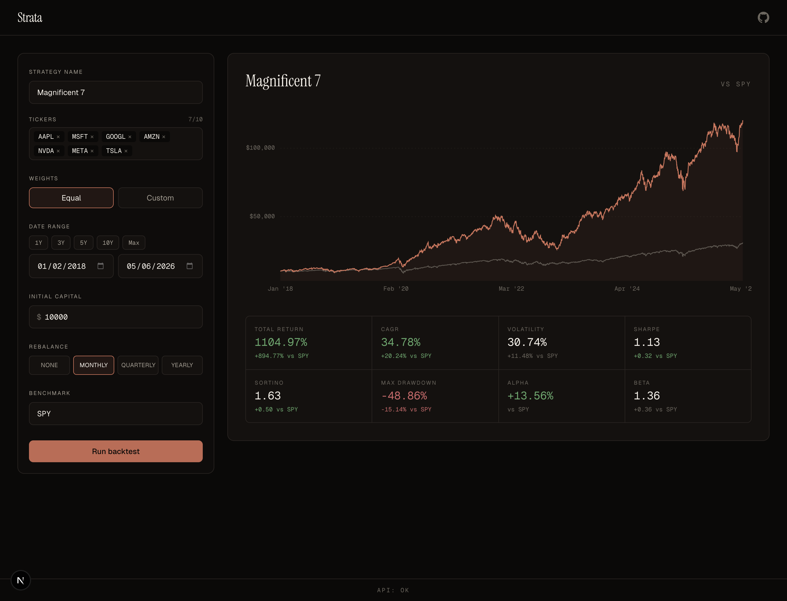
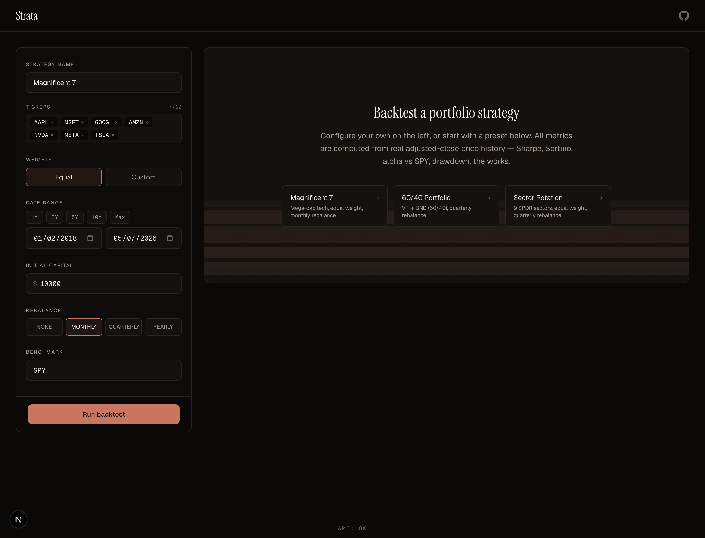

# Strata

Web-based portfolio backtester. Strategy in, equity curve out — plus rolling Sharpe, monthly-return heatmap, drawdown subchart, and the rest of the standard quant deck.

**Live demo:** _coming soon_





## Tech stack

| Layer | Choice |
|---|---|
| Frontend | Next.js 15 (App Router), React 18, TypeScript strict |
| Styling | Tailwind v3.4, CSS variables, Instrument Serif + Geist + Geist Mono |
| Charts | TradingView Lightweight Charts v5 (equity + drawdown), Recharts (histogram, rolling Sharpe), CSS grid (heatmap) |
| Backend | FastAPI (Python 3.12), Pydantic v2 |
| Data | yfinance for fetch, Postgres (Supabase) as cache, psycopg 3 + psycopg-pool |
| Math | numpy, pandas (pinned <3.0) |
| Validation | Zod (frontend), Pydantic (backend) |
| Deploy | Vercel (Next.js + Python serverless functions) |
| Local dev | uv-managed Python 3.12 venv |

## Architecture notes

The interesting decisions, not the obvious ones:

- **Postgres-backed cache for yfinance**, with a `bulk_get_cached(symbols, start, end)` that returns one DataFrame keyed by symbol from a single query. Per-row `cursor.executemany` against the Supabase transaction pooler is **brutally slow** (one round-trip per row, ~3 minutes per ticker). Switched to chunked multi-row INSERTs (500 rows/statement) for a **~500× speedup** on cold backfill. See [api/data/cache.py](api/data/cache.py).
- **`NUMERIC::float8` cast in SELECT** so psycopg returns native Python `float`s instead of `Decimal`. Constructing 12,000+ Decimals on every cache read was a 2.5 s/query cost; casting to float8 in the SQL drops that to ~250 ms. Combined with the bulk-symbol query, warm `get_prices` for 8 tickers × 7 years went from **40 s → 3 s**.
- **Linear alpha annualisation (`α_daily × 252`)** per CAPM convention — that's what Bloomberg defaults to. The geometric `(1 + α_daily)^252 − 1` form compounds the regression-noise more aggressively at high N.
- **Canonical Sortino (1980)**: denominator is `sqrt(mean(min(excess, 0)^2))` averaged over **all N** observations (positives clipped to 0), not the subset-only `sqrt(mean(neg^2 | neg < 0))`. The two differ by `sqrt(N_total / N_neg)`; I had a buggy version that returned the smaller subset-only ratio for a while. See [api/engine/metrics.py](api/engine/metrics.py).
- **Module-scope `psycopg_pool.ConnectionPool`** with FastAPI lifespan management — `connect_timeout=10`, `min_size=1`, `max_size=5`. Cold connections to the Supabase pooler take ~5–7 s; the pool keeps warm ones around so the actual request path is fast. Important for serverless because each invocation reuses the warm pool when the function instance survives.
- **Frontend Zod schemas as a runtime gate** on every API response. If the API ever drifts from the contract, the UI fails loudly with a typed error instead of producing garbage charts.

## Local development

```bash
git clone https://github.com/connorjbboulware/strata.git
cd strata

# Python (uv handles the venv + 3.12)
uv sync

# Node
npm install

# Env vars — fill in your Supabase pooler URL
cp .env.example .env
# edit .env: DATABASE_URL=postgresql://postgres.<ref>:<pw>@<pooler-host>:6543/postgres

# Optional: prime the cache for the demo
uv run python scripts/prewarm.py

# Run both servers (separate terminals)
uv run uvicorn api.index:app --port 8000 --reload
npm run dev
```

Open http://localhost:3000.

`next dev` proxies `/api/*` to `localhost:8000` via [next.config.js](next.config.js); on Vercel the same path is rewritten to `api/index.py` via [vercel.json](vercel.json).

## Methodology

- **Returns** are computed off **adjusted close** (yfinance's `Adj Close` column, not raw `Close`). Dividends and splits are reinvested into the price series, so the equity curve reflects total return including reinvested distributions.
- **Sharpe ratio**: `sqrt(252) · mean(excess) / sample_std(excess)`. `excess = daily_return − rf/252`. Default `rf = 0`. Sample std uses Bessel's correction (ddof = 1).
- **Sortino ratio**: same numerator, denominator is the downside deviation `sqrt(mean_i(min(excess_i, 0)^2))` over all observations.
- **Alpha** annualised linearly: `α_annual = α_daily · 252` from an OLS regression of strategy excess returns on benchmark excess returns. Beta is the OLS slope. R² from residuals.
- **Volatility**: `sample_std(daily_returns) · sqrt(252)`.
- **Max drawdown**: minimum of `equity / cummax(equity) − 1` (always ≤ 0).
- **CAGR**: `(equity_end / equity_start)^(1 / years) − 1` where `years = (end_date − start_date).days / 365.25`.

## Tests

```bash
uv run pytest api/tests/ -v
```

Pure-Python unit tests for the metric calculations, rebalance schedule generation, and a synthetic-price buy-and-hold walk-through. No DB, no network.
