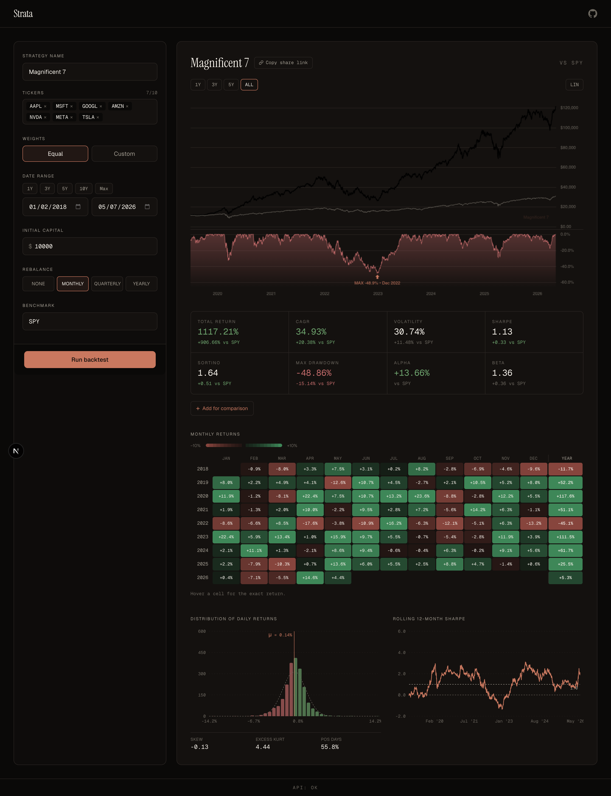

# Strata

Web-based portfolio backtester. Compose a strategy, run it against a decade of real market data, see the metrics quants care about.



**Live demo:** https://strata-brown.vercel.app/

**Try a preset** (each link bypasses the splash and loads the strategy immediately):

- **Magnificent 7 vs SPY:** https://strata-brown.vercel.app/#config=eyJ2IjoxLCJyZXF1ZXN0cyI6W3sic3RyYXRlZ2llcyI6W3sibmFtZSI6Ik1hZ25pZmljZW50IDciLCJ0aWNrZXJzIjpbIkFBUEwiLCJNU0ZUIiwiR09PR0wiLCJBTVpOIiwiTlZEQSIsIk1FVEEiLCJUU0xBIl0sIndlaWdodHMiOiJlcXVhbCIsInN0YXJ0X2RhdGUiOiIyMDE4LTAxLTAyIiwiZW5kX2RhdGUiOiIyMDI2LTA1LTA3IiwiaW5pdGlhbF9jYXBpdGFsIjoxMDAwMCwicmViYWxhbmNlX2ZyZXF1ZW5jeSI6Im1vbnRobHkifV0sImJlbmNobWFyayI6IlNQWSJ9XX0
- **60/40 Classic:** https://strata-brown.vercel.app/#config=eyJ2IjoxLCJyZXF1ZXN0cyI6W3sic3RyYXRlZ2llcyI6W3sibmFtZSI6IjYwLzQwIFBvcnRmb2xpbyIsInRpY2tlcnMiOlsiVlRJIiwiQk5EIl0sIndlaWdodHMiOlswLjYsMC40XSwic3RhcnRfZGF0ZSI6IjIwMTAtMDEtMDQiLCJlbmRfZGF0ZSI6IjIwMjYtMDUtMDciLCJpbml0aWFsX2NhcGl0YWwiOjEwMDAwLCJyZWJhbGFuY2VfZnJlcXVlbmN5IjoicXVhcnRlcmx5In1dLCJiZW5jaG1hcmsiOiJTUFkifV19
- **Sector Rotation:** https://strata-brown.vercel.app/#config=eyJ2IjoxLCJyZXF1ZXN0cyI6W3sic3RyYXRlZ2llcyI6W3sibmFtZSI6IlNlY3RvciBSb3RhdGlvbiIsInRpY2tlcnMiOlsiWExLIiwiWExGIiwiWExFIiwiWExWIiwiWExJIiwiWExQIiwiWExZIiwiWExCIiwiWExVIl0sIndlaWdodHMiOiJlcXVhbCIsInN0YXJ0X2RhdGUiOiIyMDE1LTAxLTAyIiwiZW5kX2RhdGUiOiIyMDI2LTA1LTA3IiwiaW5pdGlhbF9jYXBpdGFsIjoxMDAwMCwicmViYWxhbmNlX2ZyZXF1ZW5jeSI6InF1YXJ0ZXJseSJ9XSwiYmVuY2htYXJrIjoiU1BZIn1dfQ

(Regenerate the hashes any time with `uv run python scripts/build_share_links.py`.)

## What it does

Pick tickers, weights, date range, rebalance schedule, and a benchmark. Strata runs the backtest off real adjusted-close prices (yfinance, with a Postgres cache so the live demo doesn't block on remote fetches) and returns the equity curve, drawdown series, monthly returns, and the eight metrics on the standard quant deck — CAGR, Sharpe, Sortino, max drawdown, alpha, beta, R², annualised volatility. Three demo presets ship by default; up to three strategies can be overlaid on the same chart for comparison.

## Stack

| Layer | Choice |
|---|---|
| Frontend | Next.js 15 App Router + React 18 + TypeScript strict |
| Styling | Tailwind v3.4, CSS variables, Instrument Serif + Geist + Geist Mono |
| Charts | Lightweight Charts v5 (equity + drawdown), Recharts (histogram, rolling Sharpe), CSS grid (heatmap) |
| Backend | FastAPI on Vercel Python serverless functions |
| Database | Supabase Postgres, transaction pooler |
| Data | yfinance behind a Postgres cache |
| Quant | numpy, pandas (pinned <3.0) |
| Validation | Zod (frontend), Pydantic (backend) |

## What's interesting in this codebase

- **Postgres-backed yfinance cache, with `cursor.executemany` ditched in favor of chunked multi-row INSERT (~500× faster) and a `NUMERIC::float8` cast in SELECT (~10× faster).** Per-row `executemany` against the Supabase transaction pooler is one round-trip per row — three minutes per ticker for a 10-year backfill. Switched to 500-row INSERT statements and ingest dropped to a few seconds. Once cached, every NUMERIC column is cast to float8 in the SELECT itself so psycopg returns native Python floats; building 12 000+ Decimals per query was the second-largest cost. Combined, warm `get_prices` for 8 tickers × 7 years went from 40 s to 3 s. See [api/data/cache.py](api/data/cache.py).
- **Module-scope `psycopg_pool.ConnectionPool` with FastAPI lifespan management.** Cold connections to Supabase's pooler take 5–7 s; the pool keeps warm ones around so the actual request path stays fast. `max_idle=300` is tuned below Supabase's server-side close so we don't hand out dead connections, plus an active `check_connection` callback and a one-shot retry middleware on GET catch the residual race.
- **Linear alpha annualisation (α_daily × 252) and canonical Sortino formulation.** Both per the textbook conventions, both documented inline next to the math, both unit-tested. The Sortino denominator averages over **all** observations with positives clipped to zero, not just the negative subset — a real distinction with a √(N/N_neg) magnitude.
- **Lightweight Charts v5 with paired drawdown subchart and synced crosshair across panes.** Equity above, drawdown below, both in canvas, custom React tooltip card overlaid via `subscribeCrosshairMove`. Not a wrapped Recharts default — the v4→v5 API change retired `addLineSeries` in favor of `addSeries(LineSeries, …)` and moved watermarks + markers to plugins.
- **Pre-warm script primes 31 popular tickers into the cache before deploy** ([scripts/prewarm.py](scripts/prewarm.py)), so the live demo never blocks on yfinance under user latency. Idempotent — re-running it is mostly cache reads.

## Methodology

- **Returns** are computed off adjusted close (yfinance's `Adj Close`); dividends and splits are reinvested into the price series.
- **Sharpe ratio**: `sqrt(252) · mean(excess) / sample_std(excess)`. Sample std uses Bessel's correction (ddof = 1). `excess = daily_return − rf/252`. Default `rf = 0`.
- **Sortino ratio (canonical 1980)**: same numerator, denominator is `sqrt(mean(min(excess, 0)^2))` over **all** observations.
- **Alpha** annualised linearly: `α_annual = α_daily · 252`, from an OLS regression of strategy excess returns on benchmark excess returns. Beta is the OLS slope. R² from residuals.
- **Volatility**: `sample_std(daily_returns) · sqrt(252)`.
- **Max drawdown**: `min(equity / cummax(equity) − 1)`.
- **CAGR**: `(equity_end / equity_start)^(1 / years) − 1`, where `years = (end_date − start_date).days / 365.25`.

## Local development

```bash
git clone https://github.com/connorjbboulware/strata.git && cd strata
npm install && uv sync
cp .env.example .env  # then fill in DATABASE_URL with your Supabase pooler URI
uv run uvicorn api.index:app --port 8000 --reload   # in one terminal
npm run dev                                          # in another
```

Open <http://localhost:3000>. Optionally prime the cache for the demo with `uv run python scripts/prewarm.py` (~5 min cold, ~30 s warm).

## Future work

- Monte Carlo simulation for return distributions across drawdowns
- Walk-forward / out-of-sample testing
- Transaction costs and turnover penalties
- Intraday data (currently daily-only)
- Factor decomposition (Fama-French 3- and 5-factor)
- User accounts and saved strategies
